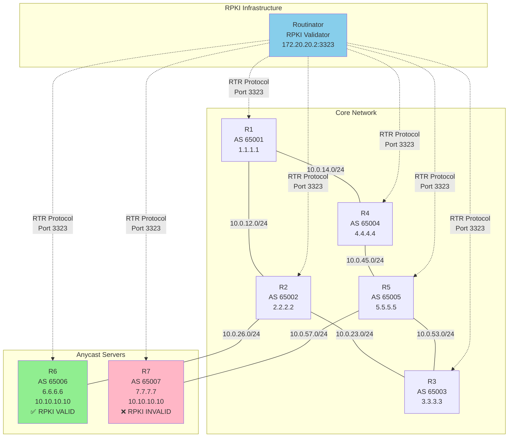

# BGP Anycast + RPKI ROV Testbed

A comprehensive containerlab-based testbed for demonstrating and testing RPKI Route Origin Validation (ROV) with BGP anycast scenarios. This project provides a production-grade environment for learning, testing, and experimenting with RPKI validation in BGP routing.

## 🎯 Overview

This testbed simulates a realistic BGP network with:
- **7 BGP routers** (AS 65001-65007) running FRRouting
- **RPKI validator** (Routinator) with local ROA configuration
- **Anycast service** (10.10.10.10/32) advertised from two locations
- **Route Origin Validation** demonstrating VALID and INVALID paths

### Key Features

- ✅ Full RPKI integration with FRRouting and Routinator
- ✅ Local ROA configuration using RFC 8416 SLURM format
- ✅ Automated setup and verification scripts
- ✅ Multiple test scenarios for RPKI validation
- ✅ Comprehensive debugging and troubleshooting commands
- ✅ Production-grade configuration patterns

## 🏗️ Network Topology



### Path Analysis

**Without RPKI ROV:**
- **Short Path (Preferred)**: R1 → R2 → R6 (AS Path: 65002 65006)
- **Long Path**: R1 → R4 → R5 → R7 (AS Path: 65004 65005 65007)

**With RPKI ROV Enabled:**
- **R6 Path**: ✅ VALID (authorized by ROA)
- **R7 Path**: ❌ INVALID (not authorized for 10.10.10.10/32)

## 🚀 Quick Start

### Prerequisites

- Linux host (Ubuntu 20.04+ recommended)
- Docker installed and running
- Containerlab installed ([installation guide](https://containerlab.dev/install/))
- Sudo privileges

### Installation

1. Clone the repository:
```bash
git clone https://github.com/Arjun4522/BGP-RPKI-ROV/
cd BGP-rpki-prod
```

2. Deploy the lab:
```bash
sudo ./setup-anycast-rpki.sh
```

The setup script will:
- Create all router configurations with RPKI support
- Deploy Routinator with local ROA definitions
- Start the containerlab topology
- Wait for BGP and RPKI to converge

3. Verify RPKI validation:
```bash
sudo ./roa-test.sh
```

This verification script will:
- Configure RPKI on all routers
- Load local ROAs into Routinator
- Verify RPKI validation states
- Display comprehensive status reports

## 📋 RPKI Configuration

### ROA Definitions (SLURM Format - RFC 8416)

The testbed uses local ROAs defined in `configs/routinator/local-exceptions.json`:

```json
{
  "locallyAddedAssertions": {
    "prefixAssertions": [
      {
        "asn": 65006,
        "prefix": "10.10.10.10/32",
        "comment": "Anycast server R6 - Valid path"
      },
      {
        "asn": 65007,
        "prefix": "7.7.7.7/32",
        "comment": "R7 loopback (NOT authorized for 10.10.10.10/32)"
      }
    ]
  }
}
```

**Key Points:**
- AS 65006 is authorized to announce 10.10.10.10/32 → **VALID**
- AS 65007 is NOT authorized to announce 10.10.10.10/32 → **INVALID**

## 🔍 Verification Commands

### Check RPKI Validation Status

```bash
# View BGP routes with RPKI validation state
sudo docker exec clab-bgp-anycast-rpki-R1 vtysh -c 'show bgp ipv4 unicast 10.10.10.10/32'
```

Expected output:
```
65002 65006
  10.0.12.2 from 10.0.12.2 (2.2.2.2)
    Origin IGP, valid, external, best (AS Path), rpki validation-state: valid

65004 65005 65007
  10.0.14.4 from 10.0.14.4 (4.4.4.4)
    Origin IGP, valid, external, rpki validation-state: invalid
```

### Check RPKI Cache Connection

```bash
sudo docker exec clab-bgp-anycast-rpki-R1 vtysh -c 'show rpki cache-connection'
```

### View RPKI Prefix Table

```bash
sudo docker exec clab-bgp-anycast-rpki-R1 vtysh -c 'show rpki prefix-table' | grep 10.10.10.10
```

### Filter Routes by Validation State

```bash
# Show only VALID routes
sudo docker exec clab-bgp-anycast-rpki-R1 vtysh -c 'show bgp ipv4 unicast rpki valid'

# Show only INVALID routes
sudo docker exec clab-bgp-anycast-rpki-R1 vtysh -c 'show bgp ipv4 unicast rpki invalid'

# Show routes with no ROA (NOT FOUND)
sudo docker exec clab-bgp-anycast-rpki-R1 vtysh -c 'show bgp ipv4 unicast rpki notfound'
```

## 🧪 Test Scenarios

### Scenario 1: Observe RPKI Validation (No Filtering)

By default, routers validate routes but don't filter based on RPKI state. Both paths are visible:

```bash
sudo docker exec clab-bgp-anycast-rpki-R1 vtysh -c 'show ip bgp 10.10.10.10/32'
```

### Scenario 2: Apply RPKI-Based Route Filtering

Configure R1 to drop INVALID routes:

```bash
sudo docker exec -it clab-bgp-anycast-rpki-R1 vtysh << 'EOF'
configure terminal
!
route-map RPKI-FILTER permit 10
 match rpki valid
!
route-map RPKI-FILTER permit 15
 match rpki notfound
!
route-map RPKI-FILTER deny 20
 match rpki invalid
!
router bgp 65001
 address-family ipv4 unicast
  neighbor 10.0.12.2 route-map RPKI-FILTER in
  neighbor 10.0.14.4 route-map RPKI-FILTER in
 exit-address-family
!
end
clear bgp ipv4 unicast * soft
EOF
```

After applying, verify only the VALID path remains:
```bash
sudo docker exec clab-bgp-anycast-rpki-R1 vtysh -c 'show ip bgp 10.10.10.10/32'
```

### Scenario 3: Simulate Failure of Valid Path

Force traffic to the INVALID path by disabling R6:

```bash
# Bring down R6's interface
sudo docker exec clab-bgp-anycast-rpki-R6 ip link set eth1 down

# Wait for BGP to reconverge
sleep 30

# Check routing table (should show INVALID path or no route if filtering is enabled)
sudo docker exec clab-bgp-anycast-rpki-R1 vtysh -c 'show ip bgp 10.10.10.10/32'

# Restore R6
sudo docker exec clab-bgp-anycast-rpki-R6 ip link set eth1 up
```

### Scenario 4: Test Connectivity

```bash
# Ping anycast IP from R1
sudo docker exec clab-bgp-anycast-rpki-R1 ping -c 3 10.10.10.10

# Traceroute to see the path
sudo docker exec clab-bgp-anycast-rpki-R1 traceroute 10.10.10.10
```

## 🎮 Interactive Access

### Access Router CLI

```bash
# Connect to R1
sudo docker exec -it clab-bgp-anycast-rpki-R1 vtysh

# Connect to other routers
sudo docker exec -it clab-bgp-anycast-rpki-R2 vtysh
sudo docker exec -it clab-bgp-anycast-rpki-R3 vtysh
# ... and so on
```

### Access Routinator

```bash
# Shell access
sudo docker exec -it clab-bgp-anycast-rpki-routinator sh

# Check VRPs (Validated ROA Payloads)
sudo docker exec clab-bgp-anycast-rpki-routinator \
  routinator -c /root/.rpki-cache/routinator.conf vrps --format csv | grep 10.10.10.10

# View Routinator metrics
curl http://localhost:9556/metrics
```

## 📊 Architecture Details

### Router Configuration

Each router is configured with:
- **FRRouting 10.2.1** with RPKI module (`-M rpki`)
- **BGP** for routing
- **RPKI client** connecting to Routinator via RTR protocol (port 3323)
- **Loopback interfaces** for router IDs

### Routinator Configuration

- **RTR Server**: Port 3324 (mapped to host 3323)
- **HTTP API**: Ports 8323, 9556
- **Local ROAs**: SLURM exceptions file (RFC 8416 format)
- **Validation Mode**: Strict (reject stale objects)
- **Refresh Interval**: 600 seconds

### Key Files

```
BGP-rpki-prod/
├── setup-anycast-rpki.sh          # Main setup script
├── roa-test.sh                     # RPKI verification script
├── bgp-anycast-rpki.clab.yml      # Containerlab topology
├── configs/
│   ├── R1-R7/                     # Router configurations
│   │   ├── frr.conf               # FRR configuration
│   │   ├── daemons                # FRR daemon config
│   │   └── vtysh.conf             # vtysh settings
│   └── routinator/
│       ├── routinator.conf        # Routinator config
│       └── local-exceptions.json  # Local ROAs (SLURM)
└── clab-bgp-anycast-rpki/         # Containerlab runtime data
```

## 🛠️ Troubleshooting

### RPKI Connection Issues

```bash
# Check if Routinator is running
sudo docker ps | grep routinator

# Check Routinator logs
sudo docker exec clab-bgp-anycast-rpki-routinator cat /tmp/routinator.log

# Check if RTR port is listening
sudo docker exec clab-bgp-anycast-rpki-routinator netstat -tln | grep 3324

# Force RPKI cache refresh on router
sudo docker exec clab-bgp-anycast-rpki-R1 vtysh -c 'rpki reset'
```

### BGP Not Converging

```bash
# Check BGP neighbor status
sudo docker exec clab-bgp-anycast-rpki-R1 vtysh -c 'show bgp summary'

# View BGP neighbor details
sudo docker exec clab-bgp-anycast-rpki-R1 vtysh -c 'show bgp neighbors'

# Force BGP session reset
sudo docker exec clab-bgp-anycast-rpki-R1 vtysh -c 'clear bgp ipv4 unicast * soft'
```

### Validation State Shows "Not Found"

```bash
# Verify ROAs are loaded in Routinator
sudo docker exec clab-bgp-anycast-rpki-routinator \
  routinator -c /root/.rpki-cache/routinator.conf vrps --format csv | grep 10.10.10.10

# Check RPKI prefix table on router
sudo docker exec clab-bgp-anycast-rpki-R1 vtysh -c 'show rpki prefix-table'

# Restart Routinator if needed
sudo docker exec clab-bgp-anycast-rpki-routinator pkill routinator
sudo docker exec -d clab-bgp-anycast-rpki-routinator \
  routinator -c /root/.rpki-cache/routinator.conf server
```

## 💥 Teardown

To destroy the lab and clean up:

```bash
sudo containerlab destroy -t bgp-anycast-rpki.clab.yml --cleanup
```

## 📚 Learning Resources

### RPKI & ROV Concepts

- **RPKI**: Resource Public Key Infrastructure
- **ROA**: Route Origin Authorization (defines which AS can originate a prefix)
- **ROV**: Route Origin Validation (verifying BGP announcements against ROAs)
- **RTR Protocol**: RPKI-to-Router protocol (RFC 8210)
- **SLURM**: Simplified Local Internet Number Resource Management (RFC 8416)

### Validation States

- **Valid**: Route matches a ROA (correct AS for the prefix)
- **Invalid**: Route contradicts a ROA (wrong AS for the prefix)
- **Not Found**: No ROA exists for the prefix

### Key RFCs

- [RFC 6480](https://tools.ietf.org/html/rfc6480): RPKI Architecture
- [RFC 6811](https://tools.ietf.org/html/rfc6811): BGP Prefix Origin Validation
- [RFC 8210](https://tools.ietf.org/html/rfc8210): RPKI to Router Protocol
- [RFC 8416](https://tools.ietf.org/html/rfc8416): SLURM Format

## 🙏 Acknowledgments

Built with:
- [Containerlab](https://containerlab.dev/) - Network lab automation
- [FRRouting](https://frrouting.org/) - BGP routing daemon
- [Routinator](https://nlnetlabs.nl/projects/rpki/routinator/) - RPKI validator by NLnet Labs

---

**Note**: This is a testbed environment using private AS numbers (65001-65007) and documentation prefixes. Not for production use.
