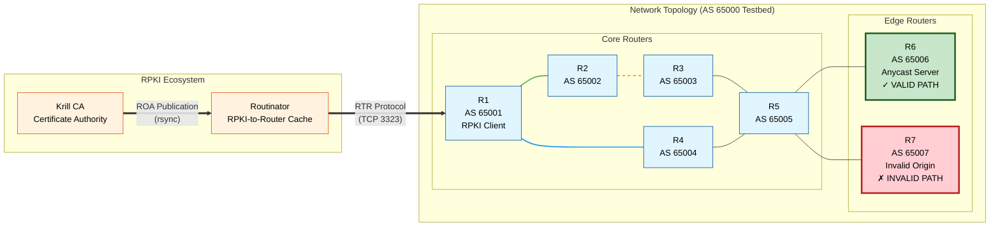

# BGP RPKI ROV Testbed with Krill and Routinator

## Architecture Overview

This testbed implements a complete Resource Public Key Infrastructure (RPKI) environment using Krill as the Certificate Authority (CA) and Routinator as the RPKI-to-Router (RTR) cache server. The setup enables Route Origin Validation (ROV) to secure BGP routing by validating route announcements against cryptographically signed Route Origin Authorizations (ROAs).

### Network Topology



### Components

1. **Krill CA**: Acts as the RPKI Certificate Authority, issuing certificates and ROAs
2. **Routinator**: Functions as the RPKI cache server, validating ROAs and serving them via RTR protocol
3. **FRRouting Routers (R1-R7)**: BGP routers configured as RPKI clients
4. **ContainerLab**: Orchestrates the containerized network topology

## Workflow

### Phase 1: Environment Setup

#### Script 1: `1-setup-topology.sh`
- Deploys the containerized network topology using ContainerLab
- Creates 7 FRRouting router containers (R1-R7)
- Establishes BGP peering relationships
- Sets up the underlying network infrastructure

#### Script 2: `2-init-krill.sh`
- Initializes the Krill CA infrastructure
- Creates the Trust Anchor (TA) and testbed CA
- Sets up the initial RPKI repository structure
- Configures Krill with proper rsync publication points

#### Script 3: `3-create-roas.sh`
- Creates Route Origin Authorizations (ROAs) for test prefixes
- Generates ROAs for:
  - 10.10.10.10/32 → AS 65006 (Valid path via R6)
  - 6.6.6.6/32 → AS 65006 (R6 loopback)
  - 7.7.7.7/32 → AS 65007 (R7 loopback - Invalid for 10.10.10.10/32)
- Publishes ROAs to the RPKI repository

### Phase 2: RPKI Cache Configuration

#### Script 4: `4-init-routinator.sh`
- Initializes Routinator as the RPKI cache server
- Configures Routinator to consume ROAs from Krill's repository
- Sets up Trust Anchor Locator (TAL) file for local testbed
- Starts Routinator RTR server on port 3323

### Phase 3: Router Integration

#### Script 5: `5-configure-routers.sh`
- Configures all routers (R1-R7) as RPKI clients
- Establishes RTR connections to Routinator on port 3323
- Enables RPKI validation for BGP routes
- Verifies successful RTR cache synchronization

### Phase 4: Verification

#### Script 6: `6-verify-setup.sh`
- Validates the entire RPKI ROV implementation
- Tests route validation states (VALID/INVALID/NOTFOUND)
- Verifies that:
  - R6's path (AS 65002 65006) is marked as VALID
  - R7's path (AS 65004 65005 65007) is marked as INVALID
- Provides comprehensive diagnostics and troubleshooting guidance

## Detailed Component Explanation

### Krill Certificate Authority

Krill serves as a complete RPKI CA implementation that:
- Manages cryptographic keys for resource holders
- Issues resource certificates for IP address blocks and AS numbers
- Creates and publishes Route Origin Authorizations (ROAs)
- Maintains a repository of signed RPKI objects
- Supports delegated publication via rsync

### Routinator RPKI Cache

Routinator functions as an RPKI-to-Router cache that:
- Fetches and validates RPKI objects from publication points
- Maintains a validated cache of ROAs and router certificates
- Serves validated ROA payloads (VRPs) via RTR protocol
- Provides HTTP API for querying validation status
- Supports local exceptions via SLURM (Simplified Local Internet Number Resource Management)

### FRRouting RPKI Integration

The FRRouting routers implement RPKI validation through:
- RTR client functionality to connect to Routinator
- Integration of RPKI validation state into BGP decision process
- Three validation states:
  - **VALID**: Route origin matches authorized ASN in ROA
  - **INVALID**: Route origin conflicts with ROA or prefix length exceeds max length
  - **NOTFOUND**: No covering ROA exists for the route

### Security Model

The testbed demonstrates the complete RPKI security model:
1. **Resource Certification**: Cryptographic assurance of resource ownership
2. **Route Authorization**: Explicit authorization of route origination
3. **Validation**: Independent validation by routers
4. **Origin Validation**: Integration of validation results into routing decisions

## Test Scenarios

### Valid Path Validation
Routes announced by R6 (AS 65006) for prefix 10.10.10.10/32 are marked as VALID because:
- A ROA exists authorizing AS 65006 to announce 10.10.10.10/32
- The BGP path (AS 65002 65006) ends with the authorized ASN
- The prefix length (32) does not exceed the ROA maximum length (32)

### Invalid Path Detection
Routes announced by R7 (AS 65007) for prefix 10.10.10.10/32 are marked as INVALID because:
- No ROA authorizes AS 65007 to announce 10.10.10.10/32
- The ROA for 10.10.10.10/32 specifically authorizes only AS 65006
- This represents a potential route hijacking attempt

### Route Origin Validation Enforcement
Advanced testing can implement Route Origin Validation (ROV) by:
- Creating route-maps that filter based on RPKI validation state
- Accepting only VALID and NOTFOUND routes (permissive mode)
- Rejecting INVALID routes (strict mode)
- Monitoring validation status for security auditing

## Usage Instructions

1. **Deploy the environment**:
   ```bash
   ./1-setup-topology.sh
   ```

2. **Initialize Krill CA**:
   ```bash
   ./2-init-krill.sh
   ```

3. **Create test ROAs**:
   ```bash
   ./3-create-roas.sh
   ```

4. **Initialize Routinator cache**:
   ```bash
   ./4-init-routinator.sh
   ```

5. **Configure routers for RPKI**:
   ```bash
   ./5-configure-routers.sh
   ```

6. **Verify the complete setup**:
   ```bash
   ./6-verify-setup.sh
   ```

## Troubleshooting

Common issues and solutions:
- **RTR connection failures**: Verify Routinator is listening on port 3323 and network connectivity
- **Validation state "NOTFOUND"**: Check that ROAs have been properly published and synchronized
- **Invalid validation results**: Verify ROA ASN and prefix match BGP announcements
- **Routinator startup issues**: Check Routinator logs in `/tmp/routinator.log` within the container

## Advanced Features

### SLURM Local Exceptions
Support for local policy overrides through RFC 8416 SLURM files:
- Filter unwanted VRPs from upstream sources
- Add locally significant assertions
- Customize validation for specific operational requirements

### HTTP API Monitoring
Routinator provides RESTful APIs for:
- Real-time validation status queries
- Metrics and monitoring endpoints
- Programmatic access to VRP data

This comprehensive testbed provides a production-ready foundation for understanding and implementing RPKI ROV in real-world networks.